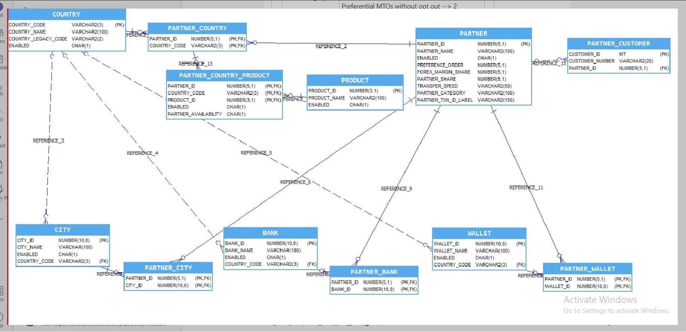

# IMRH
This project is demo for setting the (IMRH) International Money Remittance Application. There is also app part base on ionic. 
Purpose of the project is use the simple crud with ionic and different tech such as (Redis cache, Red Hat Openshift Container Clusters) for RND.

## Application Design

## Database design.
Database design make application faster in development. For a database, we are using postgres database to store the data.

## Reporting.
For reporting imrh using JasperReports. Imrh reports name mention below.
1) All Product Report => Show (Name + Status + Image) <!--Report use on the product page-->
2) All Country Report => Show (Name + Status + Image) => Count Report (City, Wallet, Bank) <!--Report use on the country page-->
3) Single Country Report => Show (Name + Status + Image) => Count Report (City, Wallet, Bank) => Display List (City, Wallet, Bank)  <!--Report use on the city,wallet,bank page-->
4) All Mto Partner Report => Show (Partner Detail) => Count Report (City, Wallet, Bank) => Display List (City, Wallet, Bank)
5) Single Mto Partner Report => Show (Partner Detail) => Count Report (City, Wallet, Bank) => Display List (City, Wallet, Bank)
6) All Partner Customer Report => Show (Partner Detail) => Count Report (Customer) => Display List (Customer)
7) All Partner Customer Report => Show (Partner Detail) => Count Report (Customer) => Display List (Customer)

## Openshift Container flow
